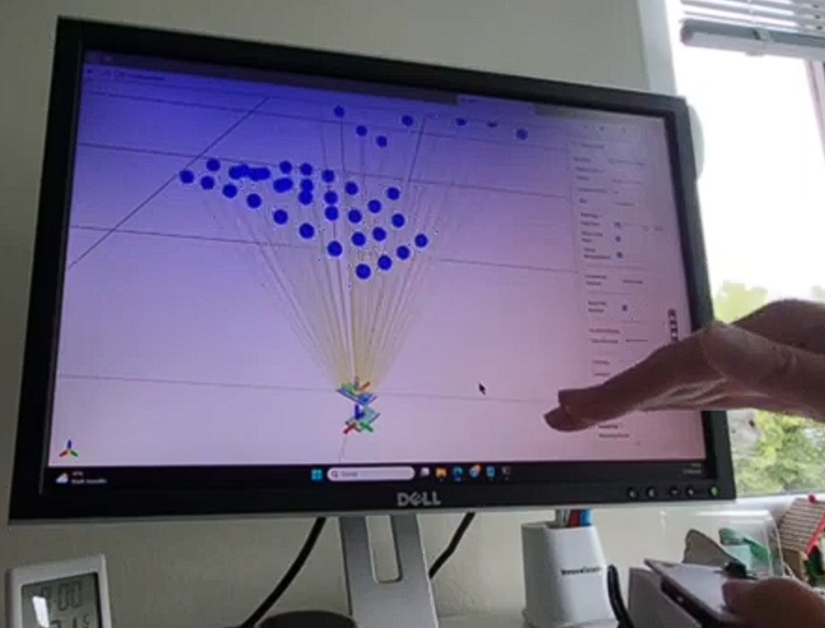

# VL53L5CX‑BNO055 Viewer (Remote)

### Ein echtzeitfähiger 3D‑Viewer für den **VL53L5CX Time‑of‑Flight‑Sensor** in Kombination mit einem **BNO055 IMU‑Sensor**.  
### Die Anwendung ist auf der Esp32 Seite in Micropython und auf der PC-Seite in Python programmiert.
### Als Entwicklungsumgebung wird Thonny verwendet.

### Verbindungsarten:

### 1. Nur Esp32-Wroom mit USB-C Kabel

### 2. Remote: ESP32-Wroom -->  Esp32-C3 (USB-C)

### 3. Remote: ESP32-Wroom über Wifi-AP ssid : VL53L5CX-BNO055   

### Hardware Verdrahtung mit ESP32-Wroom 

### BMo055 adafruid    adr: 0x28  p_arr = [q[0],-q[2],q[1],q[3]]

### BMo055 china clone adr: 0x29  p_arr = [q[0],-q[1],-q[2],q[3]]

## Software:

### mp-extras/vl53l5cx https://github.com/mp-extras/vl53l5cx

### main_data_wifi.py :  esp32 wroom
### create "lib" and upload in "lib" directory : ​vl53l5cx
### copy into root folder : sensors.py

### lib BNo055 https://github.com/micropython-IMU/micropython-bno055
### copy into root folder : bno055.py, bno055_base,py

### Funktionsweise und optischer Aufbau des Senders: 
### Das System sendet Infrarotlicht (940 nm VCSEL, Vertical-Cavity Surface-Emitting Laser) aus. Ein diffraktives optisches Element (DOE) beinflusst den Strahl so, dass ein quadratisches Sichtfeld (Field of View, FoV) von bis zu 63° ausgeleuchtet wird.
### Empfänger: 
### Das reflektierte Licht wird über ein Empfänger-Linsensystem auf eine spezielle Empfangsmatrix geleitet. Diese besteht aus einer SPAD-Anordnung (Single Photon Avalanche Diode), die in 64 einzelne Messzonen (8 x 8 Gitter) unterteilt ist.
### Distanzberechnung: 
### Der Sensor nutzt die Direct ToF-Technologie. Er misst direkt die Zeit \(t\), die ein Laserpuls für die Strecke vom Sensor zum Objekt und wieder zurück benötigt. Die Entfernung \(s\) zum Objekt wird anschließend anhand der konstanten Lichtgeschwindigkeit \(c\) berechnet. Dies wird für alle Strahlen (64) berechnet. Deshalb ergibt sich für ein 4x4 FoV eine Frequenz von 60Hz und für ein 8x8 FoV eine Frequenz von 15 Hz.

### https://www.glowscript.org/#/user/mmb18/folder/MyPrograms/program/VL53L5CX-BNO055-viewer

### Repository klonen

git clone https://github.com/mmb18021957/VL53L5CX-BNO055-Viewer.git

cd VL53L5CX-BNO055-Viewer
"# VL53L5CX-BNO055-Viewer" 
